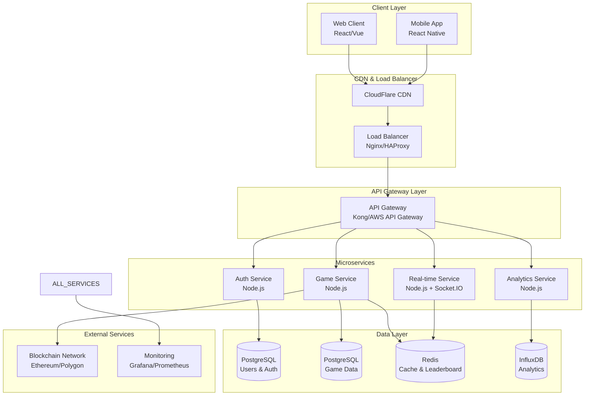
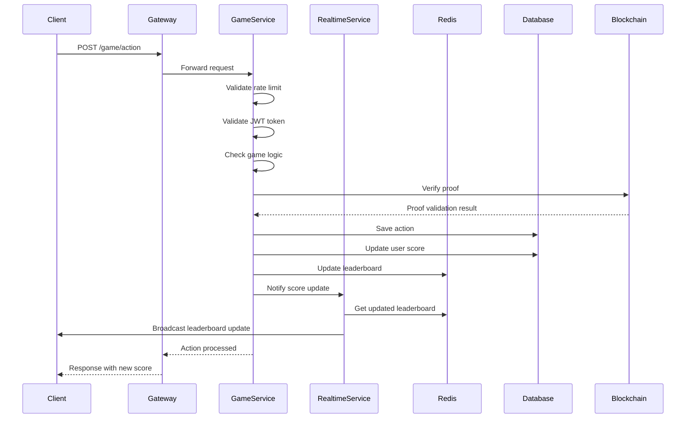
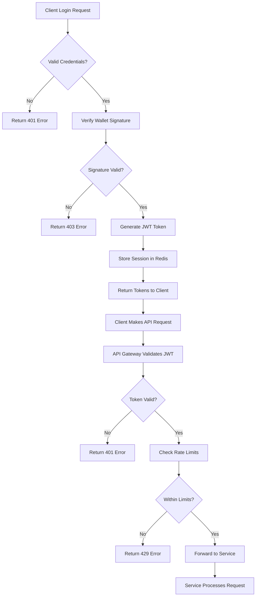
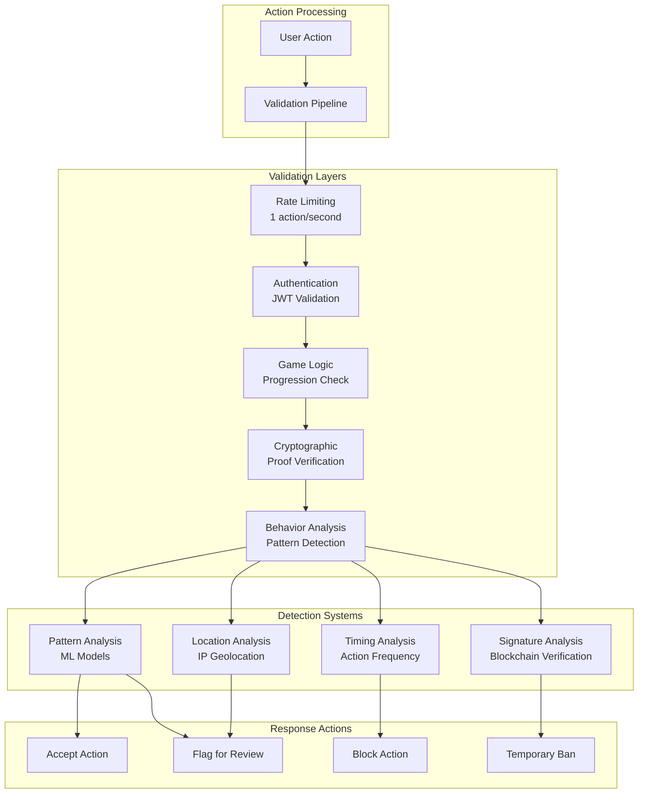
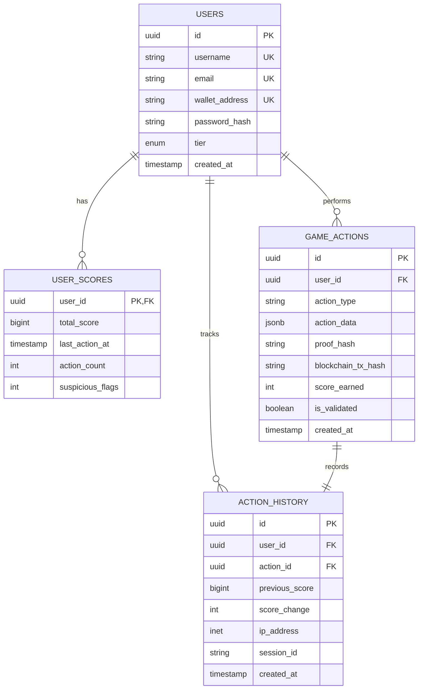
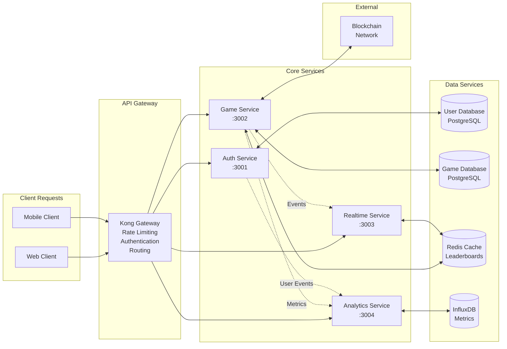
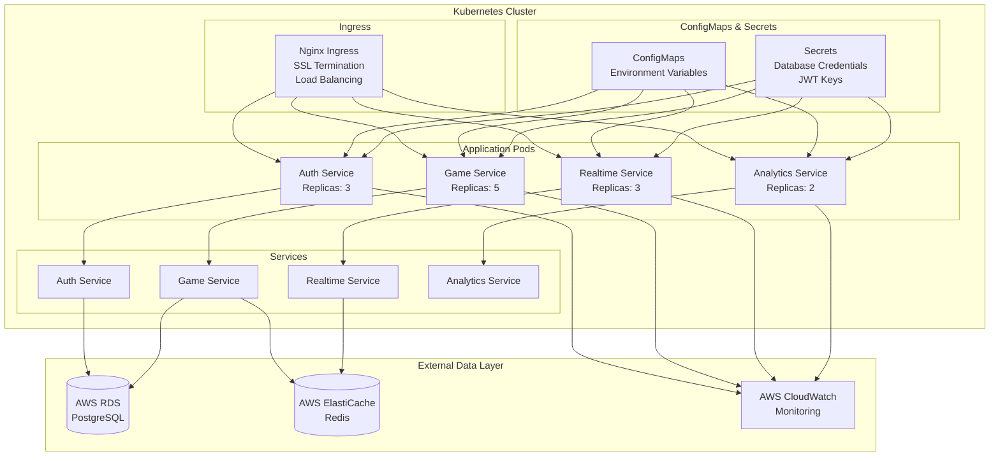
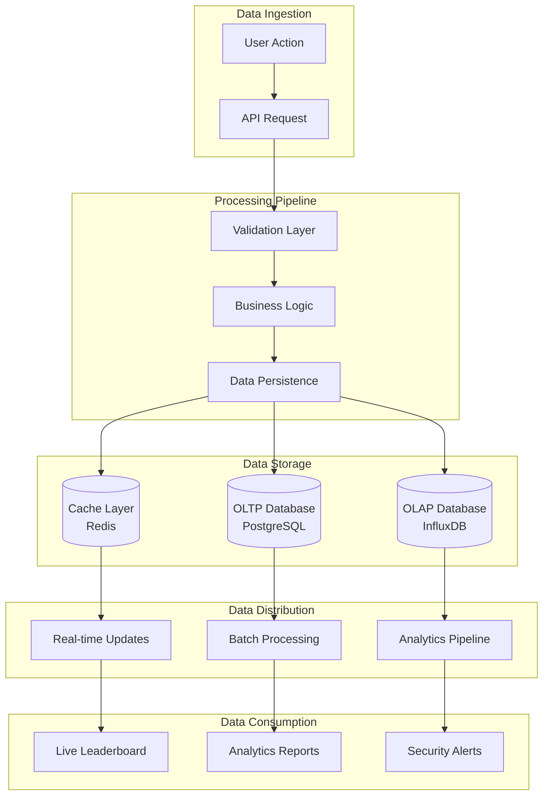
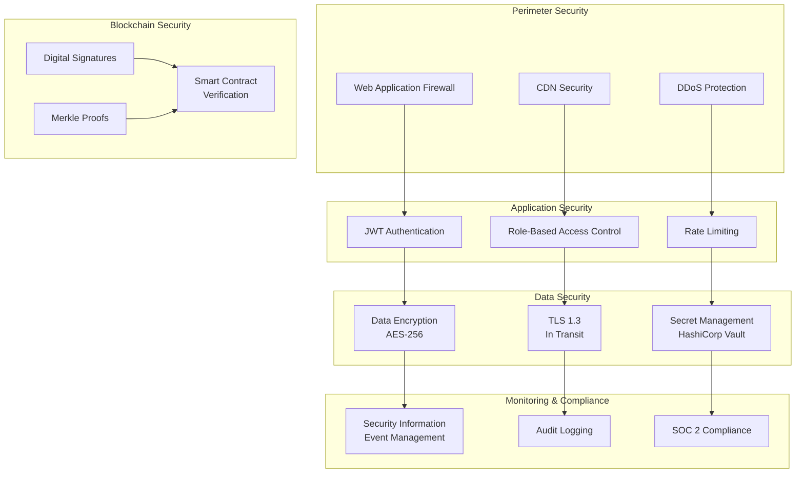
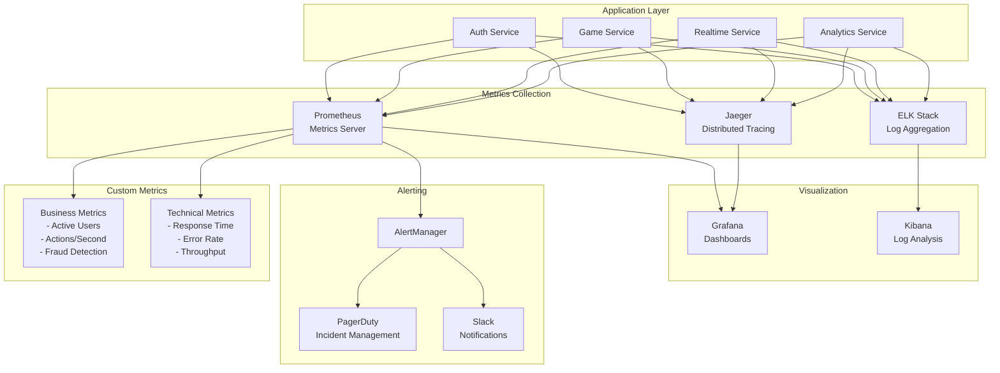

# System Architecture Diagrams

## 1. High-Level System Architecture

## 2. Real-time Communication Flow

## 3. Authentication & Authorization Flow

## 4. Anti-Cheat System Architecture

## 5. Database Schema Relationships

## 6. Microservices Communication

## 7. Deployment Architecture (Kubernetes)

## 8. Data Flow Architecture

## 9. Security Architecture

## 10. Monitoring & Observability

